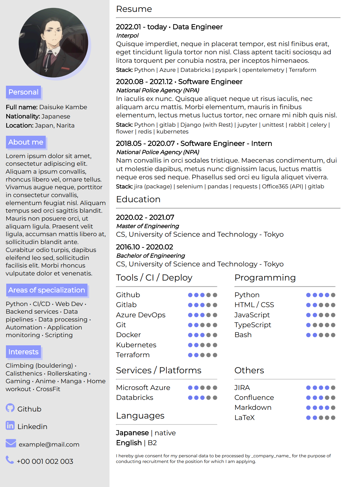

# web-page-cv-template

An example of CV written in pure HTML/CSS. You can serve it locally and then print it to PDF using your browser.

[GH pages link](https://workata.github.io/web-page-cv-template/web_page_cv/)




Dev:
```sh
npx live-server web_page_cv/
```
